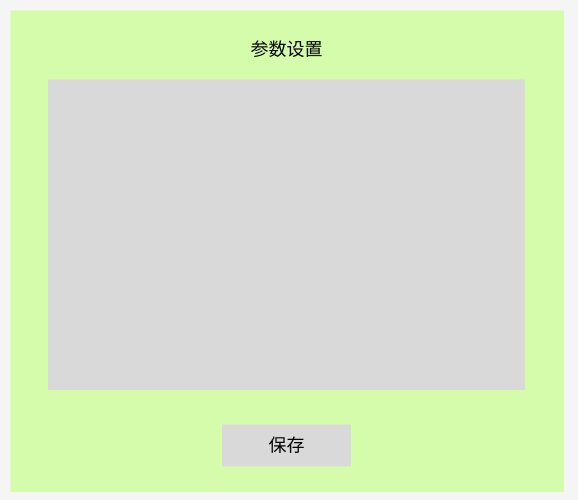

# 交互式电路模块模拟器设计方案

# 需求文档 v1.0

## 核心需求

1. 显示预先定义的电路图清单

2. 允许点击电路图中的元器件

3. 自定义被点击元器件的参数

4. 设置电路模块输入信号

5. 获取并显示电路输出结果

## 技术栈选择

### 前端框架

- Vue 3（Composition API）：提供良好的交互式应用、组合式 API
- TypeScript：提供良好的组件结构和类型安全
- Vite：快速构建工具

### UI 组件库

- TinyVue：丰富的 UI 组件

### 电路图展示

- SVG：轻量级且可交互的矢量图形

- SVG 指令：简化 SVG 在 Vue 中的使用

### 电路计算

- 自定义 JavaScript 函数：简单数学计算

- Math.js：复杂数学运算

### 数据可视化

- Chart.js + vue-chartjs：简单易用的图表库

## 实现方案

### 界面原型图





### 数据结构设计

- 元器件

```typescript
export interface Component {
  id: string;
  type: string;
  value: number;
  unit: string; // 'Ω', 'F', 'V', etc.
  position: { x: number, y: number }; // 在 SVG 中的位置
}
```

- 输入控制
```typescript
export interface Input {
  type: string;
  value: number;
  frequency?: number;
}
```
- 电路模块
```typescript
export interface Circuit {
  components: Component[];
  input: {
    type: string;
    value: number;
    frequency?: number;
  };
  output: number[];
}
```

### 项目结构

```bash
src/
├── components/
│   ├── CircuitModule.vue      # 电路模块展示组件
│   ├── ParameterPanel.vue     # 参数编辑面板
│   ├── InputControls.vue      # 输入控制组件
│   └── OutputDisplay.vue      # 输出显示组件
├── composables/
│   └── useCircuitSimulation.ts # 电路计算逻辑
├── types/                      # TypeScript类型定义
│   └── component.ts
│   └── circuit.ts
├── data/
│   └── circuitData.ts        # 预定义电路数据
├── App.vue
└── main.ts
```

## 开发步骤

1. 设计电路图 SVG：创建所有需要的电路图SVG模板

2. 实现组件点击功能：为 SVG 中的每个元器件添加点击事件

3. 创建参数面板：实现参数编辑界面

4. 实现输入控制：创建信号源设置界面

5. 开发计算逻辑：根据电路类型实现相应的计算函数

6. 添加输出显示：使用图表库显示计算结果

# 材料清单

| 序号 | 内容     | 详细             |
|----|--------|----------------|
| 1  | 元器件清单  | 元件图、主要参数及电气符号  |
| 2  | 电路模块清单 | 模块拓扑图、输入输出计算公式 |

# 进度规划

## 阶段一

1. 前期准备
- 沟通确定系统需求，包括功能需求、UI 界面
- 准备前期系统开发所需素材，包括元器件清单、电路模块清单
- 确定系统开发技术栈选择,包括前端框架、组件库

2. 绘制电气元件 SVG 矢量图
- 结合元器件清单，按照统一规格使用代码绘制 SVG 矢量图
- 样式、尺寸大小必须一致

3. 设计系统界面原型图
- 根据功能需求设计初版原型图
- 确定定稿原型图

4. 配置系统开发环境
- 前端框架
- UI 组件库

5. 编写输入输出计算公式
- 使用 JavaScript 编写计算公式

## 阶段二

1. 开发系统界面

2. 设计功能交互

3. 开展单元测试、功能测试

## 阶段三

1. 系统测试

2. 部署上线，嵌入内网工作平台